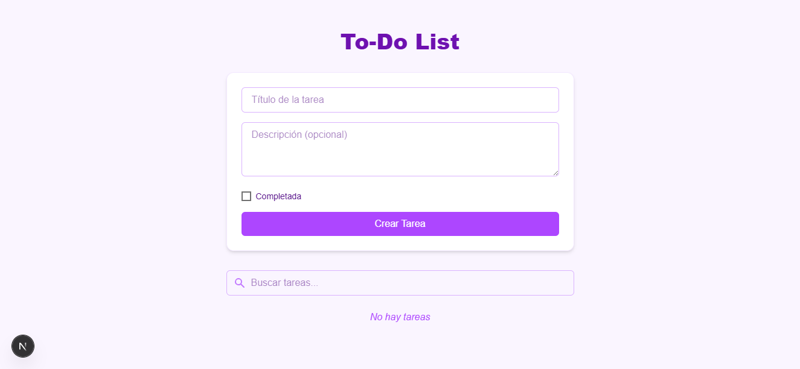

# To-Do List (Next.js)

Este es un proyecto para gestionar tareas, desarrollado con **Next.js**. Permite crear, obtener, actualizar y eliminar tareas utilizando un almacenamiento temporal en memoria.

## Instalación y Ejecución

### 1️⃣ Clonar el repositorio
```bash
git clone https://github.com/tu-usuario/nombre-del-repositorio.git
cd nombre-del-repositorio
```

### 2️⃣ Instalar dependencias
El proyecto utiliza `pnpm`, pero también podes usar `npm` o `yarn`.
```bash
pnpm install
# o
npm install
# o
yarn install
```

### 3️⃣ Ejecutar el servidor en modo desarrollo
```bash
pnpm dev
# o
npm run dev
# o
yarn dev
```
Esto iniciará el servidor en `http://localhost:3001/`.

---

## Endpoints de la API

### Obtener todas las tareas
**GET** `/api/tasks`
```bash
curl -X GET http://localhost:3001/api/tasks
```

### Crear una nueva tarea
**POST** `/api/tasks`
```bash
curl -X POST http://localhost:3001/api/tasks   -H "Content-Type: application/json"   -d '{"title": "Nueva tarea", "description": "Descripción de la tarea"}'
```

### Actualizar una tarea
**PUT** `/api/tasks/:id`
```bash
curl -X PUT http://localhost:3001/api/tasks/{taskId}   -H "Content-Type: application/json"   -d '{"title": "Tarea actualizada", "completed": true}'
```

### Eliminar una tarea
**DELETE** `/api/tasks/:id`
```bash
curl -X DELETE http://localhost:3001/api/tasks/{taskId}
```

---

## Estructura del proyecto
```
src/
│── app/
│   ├── api/
│   │   ├── tasks/
│   │   │   ├── route.js   # Endpoints para obtener y crear tareas
│   │   │   ├── [id]/
│   │   │   │   ├── route.js  # Endpoints para actualizar y eliminar tareas
│── lib/
│   ├── tasks.js  # Lógica para manejar tareas en memoria
│── package.json
│── README.md
```

---

## Consideraciones
- El proyecto utiliza almacenamiento **en memoria**, lo que significa que los datos se reinician cada vez que el servidor se detiene.

Aplicacion Funcionando


Lista de Tareas


Actualizar Tarea


Tarea Actualizada

